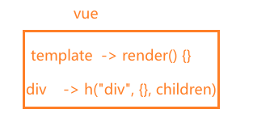

react特点

声明式编程，组件化开发，一次学习，多平台适配

# 快速上手

引入依赖

```html
<!-- 引入 React -->
<script src="https://unpkg.com/react@18/umd/react.development.js" crossorigin></script>
<!-- 引入 ReactDOM -->
<script src="https://unpkg.com/react-dom@18/umd/react-dom.development.js" crossorigin></script>
<!-- 引入 Babel，用于在浏览器中编译 JSX -->
<script src="https://unpkg.com/babel-standalone@6/babel.min.js"></script>
```

+ react包中包含了react web和react-native所共同拥有的核心代码。

+ react-dom针对web和native所完成的事情不同：
  + web端：react-dom会将jsx最终渲染成真实的DOM，显示在浏览器中
  + native端：react-dom会将jsx最终渲染成原生的控件（比如Android中的Button，iOS中的UIButton）。

+ **Babel** ，又名 **Babel.js**。
  + 是目前前端使用非常广泛的编译器、转移器。
  
  + 比如当下很多浏览器并不支持ES6的语法，但是确实ES6的语法非常的简洁和方便，我们**开发时**希望使用它。
  
  + 那么编写源码时我们就可以使用ES6来编写，之后通过Babel工具，将ES6转成大多数浏览器都支持的ES5的语法。
  
+ **React和Babel的关系：**

  + 默认情况下开发React其实可以不使用babel。

  + 但是前提是我们自己使用 React.createElement 来编写源代码，它编写的代码非常的繁琐和可读性差。

  + 那么我们就可以直接编写jsx（JavaScript XML）的语法，并且让babel帮助我们转换成React.createElement。

渲染元素

```html
<div id="root"></div>
//让babel识别到，表示这是要使用babel解析jsx的scripr代码块
<script type="text/babel">
        // 编写react代码(jsx代码)
        // react18之前
        ReactDOM.render(<h2>hello world</h2>, document.querySelector("#root"))
        //react18之后
        const root = ReactDOM.createRoot(document.querySelector("#root"))
        root.render((<h2>hello world</h2>))
</script>
```

react！启动！


案例一，点击按钮修改world为react

```js
const root = ReactDOM.createRoot(document.querySelector("#root"))

// 当前文本写死，要想修改最好不修改dom，太传统了。
// 1.将文本定义成变量
// 2.监听按钮点击

//定义数据及方法
let message = "hello world"

function btnClick() {
    message = "oi react"
    // react默认更新值之后不会重新渲染dom,故手动更新
    root.render((
        <div>
            <h2>{message}</h2>
            <button onClick={btnClick}>修改文本</button>
        </div>
    ))
}

//使用数据、方法
root.render((
    <div>
    	<h2>{message}</h2>
    	<button onClick={btnClick}>修改文本</button>
    </div>
))
```

与vue相比，渲染dom的过程是可见的，这也使得react相比vue更加灵活，我们还可以将渲染函数封装。

```js
function rooterRender() {
    root.render((
        <div>
            <h2>{message}</h2>
            <button onClick={btnClick}>修改文本</button>
        </div>
    ))
}
```

###### 初识类组件

```js
//创建类组件
class App extends React.Component{
    constructor(){
        super()
        this.state = {
            message:"Hello World"
        }
        // 绑定this的另外一种写法，同时{}中直接写this.方法
        // this.sayHello = this.sayHello.bind(this)
    }
    //组件方法(实例方法)
    sayHello() {
        // 若不绑定，值为undefined
        // 在{}中绑定this之后，this为App类
        console.log(this);
        
        //直接修改是错误的。因为修改之后,react不会自动帮你渲染DOM
        // this.state.message = "oi react"

        //继承自Components类的setState方法内部完成了两件事：
        // 1.将state中message值改掉
        // 2.自动重新执行render函数
        this.setState({
            message: "oi react"
        })
    }
    render() {
        return (
            <div>
                <h2>{this.state.message}</h2>
                <button onClick={this.sayHello.bind(this)}>点我</button>
            </div>
        )
    }
}
//创建根组件
const root = ReactDOM.createRoot(document.querySelector("#root"))
//将组件渲染到页面上
// jsx,可被转化为React.createElement
root.render(<App/>)

//关于this的指向
const fun = new App()
fun.sayHello()//App,通过对象调用
const test = fun.sayHello
test()//undefined,类里面的方法是在严格模式下的
function a() {
    console.log(this);
}
a()//undefined,babel模式下是严格模式。(若此时不使用babel，恢复默认模式则this为window)
```

关于this的绑定

+ 默认模式下，全局函数的this是window。使用babel时是严格模式，故此时全局函数的this也为undefined
+ 类里面的方法是在严格模式下的，在不使用显示绑定时，this是undefined

组件数据

+ 数据存储：参与页面更新的数据定义在当前数据的state中，我们可以通过在构造函数中 this.state = {定义的数据}

+ 数据更新：当我们的数据发生变化时，我们可以调用 this.setState 来更新数据，并且通知React进行update操作； 在进行update操作时，就会重新调用render函数，并且使用最新的数据，来渲染界面

组件方法

+ 绑定this：组件方法需要手动绑定this(指向该类)，才能操作类下的数据。默认值是undefined。(因为在正常的DOM操作中，监听点击，监听函数中的this其实是节点对象（比如说是button对象）；React并不是直接渲染成真实的DOM，我们所编写的button只是一个语法糖，它的本质React的Element对象）
+ this绑定方式1：(render函数内部调用时绑定)`<button onClick={this.fun.bind(this)}>点我</button>`
+ this绑定方式2：(类构造函数中提前绑定好)` this.fun = this.fun.bind(this)`
+ 箭头函数(挖坑，以后讲)

经典案例:电影列表

```js
// 1创建root
const root = ReactDOM.createRoot(document.querySelector("#root"))
class App extends React.Component{
    constructor () {
        super()
        this.state = {
            title:"电影",
            movies:[
                "小森林",
                "钢的琴",
                "大话东游"
            ]
        }
    }
    render() {
        // 1.对movies进行for循环
        const liEls = []
        for (let i = 0; i < this.state.movies.length; i++){
            const movie = this.state.movies[i]
            const liEl = <li>{movie}</li>
            liEls.push(liEl)
        }
        // 2.movies数组=>liEls数组，使用map映射，遍历movies中的每一项movie，返回liEl构成数组liEls
        const liEls = this.state.movies.map(movie => <li>{movie}</li>)
        // 3.liEls直接写下面，map优雅，实在是太优雅了
        return (
            <div>
                <h2>{this.state.title}</h2>
                <ul>{liEls}</ul>
                <ul>{ this.state.movies.map(movie => <li>{movie}</li>)}</ul>
            </div>
        )
    }
}
// 2渲染组件
root.render(<App/>)
```

关于const的一个疑问(const没学好)

```js
//在for循环里面使用const正确吗？ const 不是定义一个常量吗？那movie的值不是会改变吗？               
const liEls = []
for (let i = 0; i < this.state.movies.length; i++){
    const movie = this.state.movies[i]
    const liEl = <li>{movie}</li>
    liEls.push(liEl)
}
```

在 JavaScript 中，`const` 关键字用于声明一次赋值后变量值不可再改变的变量。但是，这个“不可改变”只适用于变量的引用，不适用于变量的内容。换句话说，如果你声明了一个对象或数组为 `const`，你不能再把该变量指向另一个对象或数组，但是你可以改变对象的属性或数组的元素。

在 `for` 循环中，每次迭代都会创建一个新的作用域。所以在你的例子中，每次循环迭代时声明的 `movie` 是一个新的变量实例，它适用于这次迭代的作用域内。即使它是用 `const` 声明的，它也只是在当前迭代中不可改变。下一次迭代将会有一个全新的 `movie` 常量被创建，用于下一轮的作用域。

因此，这段代码中使用 `const` 是完全正确的，因为在每次迭代中 `movie` 和 `liEl` 都是不会改变的，它们在各自的迭代作用域中保持常量。 这是推荐的做法，因为它可以防止这些变量在它们的作用域内被重新赋值，这通常可以帮助避免编程中的错误。

###### 数组的高阶函数要复习

当然可以。在JavaScript中，数组提供了几种高阶函数，使得处理数组数据变得更加方便和高效。这些函数可以将操作抽象化，使代码更简洁、更易于理解。

1. **map()**

`map()` 方法创建一个新数组，其结果是该数组中的每个元素都调用一个提供的函数后的返回值。

举例：

```
javascript复制const numbers = [1, 2, 3, 4];
const squares = numbers.map(num => num * num);
// squares: [1, 4, 9, 16]
```

1. **filter()**

`filter()` 方法创建一个新数组，包含通过所提供函数实现的测试的所有元素。

举例：

```
javascript复制const numbers = [1, 2, 3, 4];
const evens = numbers.filter(num => num % 2 === 0);
// evens: [2, 4]
```

1. **reduce()**

`reduce()` 方法对数组中的每个元素执行一个由您提供的“reducer”回调函数，将其结果汇总为单个返回值。

举例：

```
javascript复制const numbers = [1, 2, 3, 4];
const sum = numbers.reduce((accumulator, currentValue) => accumulator + currentValue, 0);
// sum: 10
```

上面的例子中，`reduce()` 方法从数组的第一个元素开始，累加至最后一个元素。

除了这些，还有其他一些有用的高阶函数，比如 `forEach()`, `some()`, `every()`, 和 `find()` 等。

- `forEach()` 对数组的每个元素执行一次提供的函数，但不返回任何值（undefined）。
- `some()` 测试数组中是不是至少有1个元素通过了被提供的函数测试。
- `every()` 测试一个数组内的所有元素是否都能通过某个指定函数的测试。
- `find()` 方法返回数组中满足提供的测试函数的第一个元素的值，否则返回 undefined。

注意：所有这些方法都不会修改原始数组，而是返回一个新数组或值。这些方法的一个主要优点是它们都使用函数式编程原则，意味着每次操作都是无副作用的，并且它们都支持链式调用，可以组合使用来实现复杂的数组操作。

###### 解构赋值要复习

在JavaScript中，解构赋值是一种简洁的语法，它允许你直接从数组或对象中提取数据到变量中。在你的例子中：

```javascript
//message = this.state.message
const { message } = this.state;
```

这行代码做了以下几件事情：

1. 查找 `this.state` 对象中的 `message` 属性。
2. 创建一个名为 `message` 的新变量。
3. 将 `this.state` 对象中 `message` 属性的值赋给这个新变量。

这是对象解构的一个简单示例，它可以让你轻松访问对象中的属性，并将其存储在具有相同名称的变量中。如果没有解构，你可能需要编写代码如下：

```javascript
const message = this.state.message;
```

解构赋值使代码更干净、更易读，并且可以在一行内从对象中提取多个属性。比如：

```javascript
const { message, status, error } = this.state;
```

以上代码一次性创建了三个新变量 `message`、`status` 和 `error`，并将对应 `this.state` 中的属性值赋给它们。这样的操作让你不必重复书写 `this.state`，使得代码更加简洁。解构在React以及其他现代JavaScript框架和库中被广泛使用。

计数器案例


```js
<div id="root"></div>
<script type="text/babel">
    const root = ReactDOM.createRoot(document.querySelector("#root"))
    class App extends React.Component {
        constructor() {
            super()
            this.state = {
                message: "计数器",
                counter:10
            }
            this.decrement = this.decrement.bind(this)
            this.increment = this.increment.bind(this)
        }
        render() {
            //对象的解构
            const {message,counter} = this.state
            return (
                <div>
                    <h2>{message}</h2>
                    <h3>{counter}</h3>
                    <button onClick={this.increment}>+</button>
                    <button onClick={this.decrement}>-</button>
                </div>
            )
        }
        increment() {
            this.setState({
                counter: this.state.counter+1
            })
        }
        decrement() {
            this.setState({
                counter: this.state.counter-1
            })
        }
    }
    root.render(<App />)
</script>
```

# JSX语法

### 认识jsx语法

+ JSX到底是什么呢？

  + JSX是一种JavaScript的语法扩展（eXtension）也在很多地方称之为JavaScript XML，因为看起就是一段XML语法

  + 它用于描述我们的UI界面，并且其完成可以和JavaScript融合在一起使用

  + 它不同于Vue中的模块语法，你不需要专门学习模块语法中的一些指令（比如v-for、v-if、v-else、v-bind）v-for可以用map绑定，v-if就使用if,else就使用else...真是all in js哈。多做做react项目吧，js一起跟着练了

在我们之前的案例中，出现了这样的代码：

```js
const element = <h2>title</h2>
```

+ 等号右边的标签语法是什么呢？它不是一段字符串（因为没有使用引号包裹）

+ 其实写在js中，是会报错的。之前的案例中不报错是因为babel将这段代码作出了转换。转换为浏览器可以识别的代码->`React.createElement("h2",null,"title")`

这一部分在原有的js上扩展出来的语法就是JSX语法。其实就是html in js(html写在js里面)

React设计哲学

+ js和html的耦合性好强，所以我把html写在js里面好了，不要绑来绑去了。

React的书写规范

+  JSX的顶层只能有一个根元素，所以我们很多时候会在外层包裹一个div元素（或者使用后面我们学习的Fragment,vue3中通过使用Fragment实现多个根）

+ 为了方便阅读，我们通常在jsx的外层包裹一个小括号()，这样可以方便阅读，并且jsx可以进行换行书写

+ JSX中的标签可以是单标签，也可以是双标签； 注意：如果是单标签，必须以/>结尾；

  ```js
  render() {
      //小括号
      return (
          //只能有一个根元素
          <div>
          	//单标签结尾的"/"不能省略
          	<br/>
          </div>
      )
  }
  //以下两种都可以
  root.render(<App></App>)
  root.render(<App/>)
  ```

### 基本使用

###### JSX注释

非jsx文件中要手动写(vsc不知道你要写react)，jsx文件中直接crtl+"/"

```js
render() {
    //注释
    return (
        //注释
        <div>
        {/* 注释*/}
        <h2>title</h2>
        </div>
    )
}
```

###### JSX嵌入变量作为子元素

包括（Number、String、Array）（null、undefined、Boolean）Object、表达式、三元运算符、方法

```js
const root = ReactDOM.createRoot(document.querySelector("#root"))
class App extends React.Component {
    constructor() {
        super()
        this.state = {
            message: "hello",
            names: ["菩提树树", "铁锅炖素鹅", "鸣蜩哿号"],
            counter: 10,
            money: null,
            mate: undefined,
            poor: true,
            friend: {
                1: "伯牙善古琴",
                2: "上海世博会",
                3: "天淇老冰棍",
                4: "假期爽"
            },
            firstName: "r",
            lastName: "hy",

            age: 20,

            movies: ["流浪地球", "独行月球"]
        }
    }
    render() {
        //1.插入标识符
        const { message, names, counter } = this.state
        const { money, mate, poor } = this.state
        const { friend } = this.state
        
        //2.对内容进行计算之后插入
        const { firstName, lastName } = this.state
        {/*达到和计算属性相同的结果*/ }
        const fullName = firstName + " " + lastName
        const { age } = this.state
        const ageTest = age>18?"成年人":"未成年人"
        const liEls  = this.state.movies.map(movie => <li>{movie}</li>)
                                             
        //3.返回jsx                                  
        return (
            <div>
                {/*1.Number、String、Array直接显示*/}
                <h2>{message}</h2>
                <h3>{names}</h3>
                <h2>{counter}</h2>
                {/*2.null、undefined、Boolean不直接显示*/}
                {/*因为值是undefined的数据可能是需要服务器返回的，React做了一个忽略*/}
                <h2>{money}</h2>
                <h3>{mate}</h3>
                <h2>{poor}</h2>
                {/*想要显示要做转haunt，一般用不着*/}
                {String(money)}
                {mate + ""}
                {poor.toString()}
                {/*3.Objects*/}
                {/*Objects are not valid as a React child*/}
                <h2>{Object.keys(friend)[0]}</h2>
                {/*4.表达式*/}
                <h2>{2 + 3}</h2>
                <h2>{firstName + " " + lastName}</h2>
                <h2>{fullName}</h2>
                {/*5.三元运算符*/}
                <h2>{ageTest}</h2>
                {/*6.方法*/}
                <ul>{liEls}</ul>
                <ul>{this.state.movies.map(movie => <li>{movie}</li>)}</ul>
                <ul>{this.getMoviesEls()}</ul>
            </div>
        )
    }
    //逻辑如果复杂抽取方法里面
    getMoviesEls() {
        const liEls  = this.state.movies.map(movie => <li>{movie}</li>)
        return liEls
    }
}
root.render(<App />)
```

在 JavaScript 和 React 类组件中，`this` 的行为可能会有些让人困惑，但一旦你理解了它的工作原理，就会变得清晰很多。在类组件的方法中，`this` 默认指向类的实例，这意味着你可以在类的任何方法中访问到 `this.state`、`this.props` 以及其他方法（比如 `this.getMoviesEls()`）。

当你在一个类组件的方法中使用 `this` 时（比如 `this.state` 或 `this.getMoviesEls()`），JavaScript 引擎知道 `this` 指的是类的当前实例，因为这些方法是作为类的实例方法被调用的。这是因为这些方法通常是在组件的 `render` 方法或其他生命周期方法中被调用的，这些场景下 `this` 自然地被绑定到了类的实例上。

### 为什么 `this` 能在 `getMoviesEls()` 方法中工作？

在 `getMoviesEls()` 方法中，你能成功地访问 `this.state`，是因为 `getMoviesEls` 被定义为类的一个方法，而这个类继承自 `React.Component`。当你从 `render` 方法或任何其他类的方法中调用 `getMoviesEls()` 时，`this` 已经被自动绑定到了类的实例上，这就是为什么你能够在 `getMoviesEls()` 方法中访问到 `this.state`。

### 特殊情况：手动绑定 `this` 或使用箭头函数

在某些情况下，`this` 可能不会按预期工作，特别是在事件处理器或异步操作中。这是因为这些情况下的函数调用可能会失去其原始的上下文（即类的实例）。为了解决这个问题，你可以在构造函数中手动绑定 `this`：

```javascript
constructor() {
    super();
    this.getMoviesEls = this.getMoviesEls.bind(this);
}
```

或者，使用箭头函数定义方法，箭头函数会自动绑定 `this` 到定义它们的上下文：

```javascript
getMoviesEls = () => {
    const liEls = this.state.movies.map(movie => <li>{movie}</li>);
    return liEls;
}
```

这两种方式都可以确保 `this` 在任何情况下都正确指向类的实例，从而可以访问到 `this.state` 和其他方法。

总结来说，你的 `getMoviesEls()` 方法能够访问 `this.state` 是因为它作为类的一个实例方法被调用，这种情况下 `this` 默认指向类的实例。

###### JSX属性绑定

普通绑定title、src、href。绑定class(模板字符串/数组)。绑定style(绑定对象)

芝士补充：title属性在html中是全局属性在HTML中，`title` 属性被称为全局属性，意味着它可以用在几乎所有的HTML元素上，而不仅限于特定的几个元素。全局属性是可以应用于所有HTML标签的属性，尽管有些属性可能对某些元素不会产生任何可见的效果。

```js
const root = ReactDOM.createRoot(document.querySelector("#root"))
class App extends React.Component {
    constructor() {
        super()
        this.state = {
            message: "oi react",
            title: "react",
            imgURL:"https://cn.bing.com/images/search?view=detailV···",
            href:"http://www.baidu.com",
            isActive: "true",
            objStyle: {
                color:"red"
            }
        }
    }
    render() {
        const { message, title, imgURL, href, isActive, objStyle } = this.state
        // class绑定写法1：模板字符串
        const className = `abc cba ${isActive ? 'active' : ''}`
        //class绑定写法2:数组
        const classList = ['abc', 'cba']
        if(isActive) classList.push("active")
        //写法3:第三方库
        // classnames
        return (
            <div>
                {/*1.基本绑定*/}
                <h2 title={title}>我是标题</h2>
                
                <a href={href}>百度</a>

                {/*2.绑定class属性*/}
                {/*将js中的关键字Class类作为属性名，有可能造成误解,所以最好写成className*/}
                {/*Warning: Invalid DOM property `class`. Did you mean `className`?*/}
                <h2 class="abc cba">哈哈</h2>
                <h2 className="abc cba">哈哈哈</h2>
                <h2 className={`abc cba ${isActive ? 'active' : ''}`}>哈哈哈哈哈</h2>
                <h2 className={className}>哈哈哈哈哈哈</h2>
                <h2 className={classList.join(" ")}>哈哈哈哈哈哈哈</h2>

                {/*3.绑定style:绑定对象类型 !这不是差值语法哈*/}
                {/*变量作为子元素时不能是对象，但是绑定属性时可以*/}
                <h2 style={{color:"red"}}>我是什么颜色？</h2>
                <h2 style={objStyle}>我也是红色吗？</h2>

            </div>
        )
    }

}
root.render(<App/>)
```

### 事件绑定

###### 关于this

increment内部拿不到this的原因：

` <button onClick={this.increment}>按钮</button>`

react内部:

React.createElement("button",{onClick:this.btnClick})

const click = config.onClick

click()

相当于全局调用，且在严格模式下，因此是undefined

+ 绑定方式1：bind 绑定
+ 绑定方式2：(classField的应用：)`btnClick = () => { }`
+ 绑定方式3(推荐)：` <button onClick={() => this.increment()}>按钮</button>`【按钮被点击时，触发箭头函数，箭头函数使用this调用increment函数，本质是隐式绑定。this为上层作用域render的this，也就是当前类的实例】

###### 参数传递

在事件监听器（如`onClick`）中直接使用方法名（例如`this.btnClick`）作为回调函数时，事件对象默认作为第一个参数传递给该方法。使用箭头函数来包裹方法调用时，由于箭头函数改变了函数调用的方式，事件对象不再自动作为第一个参数传递，因此需要显式地将它作为参数传递。其他参数写在括号里同时传递。

```js
class App extends React.Component {
    constructor() {
        super()
        this.state = {
            counter: 10
        }
        // this.foo = this.foo.bind(this)
    }
    render() {
        const { counter } = this.state
        return (
            <div>
                <button onClick={(event) => this.btnClick(event, "rhy", 30)}>按钮</button>
                <h2>{counter}</h2>
            </div>
        )
    }
    btnClick(event, name, age) {
        console.log("btnClick:", event, this)
        console.log("name, age", name, age)
    }
}
```

事件绑定中推荐的参数的传递方式

案例，点击电影变红

```js
const root = ReactDOM.createRoot(document.querySelector("#root"))
class App extends React.Component {
    constructor() {
        super()
        this.state = {
            movies:["言叶之庭", "你的名字", "天气之子"],
            currentIndex:0,
        }
    }
    render() {
        const { movies, currentIndex } = this.state
        return (
            <div>
                <ul>
                    {
                        movies.map((item, index) => {
                            return (
                                <li className={ currentIndex === index ? 'active' : ''}
                                    key={item}
                                    onClick={() => {this.changeColor(index)}}>
                                    {item}
                                </li>
                            )
                        })
                    }
                </ul>
            </div>
        )
    }
    changeColor(index) {
        this.setState({
            currentIndex: index
        })
    }
}
root.render(<App />)
```

案例重构抽取传入map函数的逻辑

```js
const root = ReactDOM.createRoot(document.querySelector("#root"))
class App extends React.Component {
    constructor() {
        super()
        this.state = {
            movies: ["言叶之庭", "你的名字", "天气之子"],
            currentIndex: 0,
        }
    }
    changeColor(index) {
        this.setState({
            currentIndex: index
        })
    }
    render() {
        const { movies, currentIndex } = this.state
        function itemHandle(item, index) {
            return (
                <li className={currentIndex === index ? 'active' : ''}
                    key={item}
                    onClick={() => { this.changeColor(index) }}>
                    {item}
                </li>
            )

        }
        {/*this绑定方式2(箭头函数)*/}
        const itemHandle2 = (item, index) => {
            return (
                <li className={currentIndex === index ? 'active' : ''}
                    key={item}
                    onClick={() => { this.changeColor(index) }}>
                    {item}
                </li>
            )
        }
        return (
            <div>
            	{/*this绑定方式1*/}
                <ul>{movies.map(itemHandle, this)}</ul>
                <ul>{movies.map(itemHandle2)}</ul>
            </div>
        )
    }
}
root.render(<App />)
```

### 条件渲染

```js
const root = ReactDOM.createRoot(document.querySelector("#root"))
class App extends React.Component {
    constructor() {
        super()
        this.state = {
            isReady: true,
            friend: {
                name: "汪文宣",
                desc: "寒夜"
            }
        }
    }
    render() {
        const { isReady, friend } = this.state
        let content = null
            if(isReady){
                content = <h2>我准备好了</h2>
            }else{
                content = <h2>再等一小下</h2>
            }
        
        return (
            <div>
                {/*1.根据条件给变量赋不同的值,适用于逻辑多*/}
                {content}
                {/*2.三元运算符，适用于逻辑少*/}
                {isReady?<li>我准备好了</li>:<li>再等一小下</li>}
                {/*3.逻&&辑与运算*/}
                {/*场景：当某一个值可能为undefined时，使用&&*/}
                {friend && <div>{friend.name + " " + friend.desc}</div>}
            </div>
        )
    }

}
root.render(<App />)
```

案例

```js
const root = ReactDOM.createRoot(document.querySelector("#root"))
class App extends React.Component {
    constructor() {
        super()
        this.state = {
            title:"我还在吗",
            isShow: true
        }
    }
    render() {
        const {title, isShow} = this.state
        return (
            <div>
                {/*v-if的效果*/}
                <button onClick={() => {this.change()}}>点我</button>
                <h2>{isShow ? title : ''}</h2>
                {isShow && <h2>{title}</h2>}

                {/*v-show的效果*/}
                <h2 style={{display: isShow? 'block': 'none'}}>{title}</h2>
            </div>
        )
    }
    // v-if删除元素，v-show display改为none
    change() {
        this.setState({
            isShow: !this.state.isShow
        })
    }

}
root.render(<App />)
```


### 列表渲染

主要使用数组的高阶函数map，filter，slice

```js
const root = ReactDOM.createRoot(document.querySelector("#root"))
class App extends React.Component {
    constructor() {
        super()
        this.state = {
            students:[
                {id: 111,name: "小红",score:5},
                {id: 112,name: "小华",score:21},
                {id: 113,name: "小明",score:38}

            ]
        }
    }
    render() {
        const {students} = this.state
        // 分数大于100
        const filterStudents = students.filter(item => {
            return item.score > 20
        })
        // 只展示前两个[start, end)
        const sliceStudents = filterStudents.slice(0,2)

        //或者在下面直接链式调用
        students.filter(item => item.score > 100).slice(0, 2).map

        return (
            <div>
                <h2>学生信息列表</h2>
                <div class="list">
                    {
                        sliceStudents.map(item => {
                            return (
                                <div class="item" key={item.id}>
                                    <h2>学号：{item.name}</h2>
                                    <h2>姓名：{item.id}</h2>
                                    <h2>分数：{item.score}</h2>
                                </div>
                            )
                        })
                    }
                </div>

            </div>
        )
    }

}
root.render(<App />)
```

### 原理及本质

jsx 是 React.createElement(component, props, ...children) 函数的语法糖。所有的jsx最终都会被转换成React.createElement的函数调用。

**createElement需要传递三个参数：**

+  参数一：type

  + 当前ReactElement的类型；

  + 如果是标签元素，那么就使用字符串表示 “div”；

  + 如果是组件元素，那么就直接使用组件的名称；
+  参数二：config

  + 所有jsx中的属性都在config中以对象的属性和值的形式存储；
  + 比如传入className作为元素的class；
+  参数三：children
   + 存放在标签中的内容，以children数组的方式进行存储；

React17之后，转换的实现方式在底层有所更新。

- **React框架**：引入了新的转换方法和必要的底层支持。
- **构建工具**（例如Babel）：通过插件或更新实现了对新JSX转换的编译支持

这种新方式不再需要在你的React文件中导入React来使用JSX。

在老版本的React中（React 16及之前），当你使用JSX时，你需要在文件顶部导入React，因为JSX会被转换为`React.createElement`调用。例如，下面的JSX代码：

```jsx
import React from 'react';

const element = <div>Hello, world!</div>;
```

在编译后，会被转换成普通的JavaScript，如下：

```javascript
const element = React.createElement('div', null, 'Hello, world!');
```

从React 17开始，有了新的JSX转换。它引入了两个新的方法，`jsx` 和 `jsxs`，这两个方法都是从 `"react/jsx-runtime"` 模块导入的。这意味着React的核心包不再需要在每个使用JSX的文件中导入。新方式如下：

```jsx
import { jsx as _jsx } from "react/jsx-runtime";

const element = _jsx("div", { children: "Hello, world!" });
```

在你的代码片段中，`_jsx` 用于处理只有一个子元素的JSX片段，而 `_jsxs` 用于处理有多个子元素的JSX片段。这个转换是自动完成的，通常由像Babel这样的编译器负责。

这种新的转换方法有几个好处：

1. **不需要导入React**：减少了打包大小，因为React不需要在每个文件中导入。
2. **优化性能**：新的方法可以避免子数组的创建，减少内存消耗，并提高性能。
3. **方便未来的更新**：让React团队在未来更容易引入新的改进和优化，而不会影响现有代码。

因此，这两种方式在表面上实现了同样的目的—创建React元素，但新方法提供了一些优化和便利。对于开发者来说，这个变化是透明的，因为JSX代码的编写方式没有改变，只是转换的实现方式在底层有所更新。

### 购物车案例

###### 知识补充：扩展运算符的使用

```js
increment(item, index) {
    const newBooks = this.state.books.map((b, i) => {
        if (i === index) {
            return { ...b, quantity: b.quantity + 1 };
        }
        return b;
    });
    this.setState({ books: newBooks });
}
```

在这个代码片段中，`...b` 是JavaScript的扩展运算符（spread operator）的用法。扩展运算符可以将一个数组或者对象的所有可枚举属性，拷贝到当前对象之中。

这里的 `...b` 用于创建一个新对象，这个新对象包含了对象 `b` 的所有属性值的拷贝。当你执行 `{ ...b, quantity: b.quantity + 1 }`，它实际上是在做两件事：

1. 使用 `{...b}` 拷贝了 `b` 对象的所有属性到一个新的对象中。
2. 设置新对象的 `quantity` 属性为 `b.quantity + 1`。

如果 `b` 对象中已经有一个名为 `quantity` 的属性，它的值将会被 `b.quantity + 1` 所覆盖，因为在扩展属性之后对同一个属性进行了再次定义。

总结一下，这个代码的作用是：

- 遍历 `this.state.books` 数组。
- 当当前项的索引 `i` 等于给定的 `index` 时，创建一个新的对象，这个对象具有与当前项相同的属性，并将 `quantity` 属性的值增加 `1`。
- 如果索引 `i` 不等于 `index`，则返回当前项 `b` 本身，不做修改。

这种模式通常用于在React组件的状态更新中不直接改变原始状态，而是返回一个新的状态对象，这是不可变性原则的一个实际应用，有助于提高性能并防止意外的状态变化。

###### 箭头函数简写

在JavaScript中，如果箭头函数体只包含一个表达式，那么可以省略花括号`{}`和`return`关键字，并且该表达式的结果会自动被返回。这称为“隐式返回”。

当你使用箭头函数写成这样：

```javascript
const total = books.reduce((accumulator, item) => accumulator + item.price * item.quantity, 0);
```

它是下面这个函数的缩写形式：

```javascript
const total = books.reduce((accumulator, item) => {
    return accumulator + item.price * item.quantity;
}, 0);
```

两种形式是等效的，但是第一种形式更简洁。务必记得，如果箭头函数需要执行多条语句，或者你需要在返回之前进行一些操作，那么你必须使用花括号`{}`并显式地写出`return`语句。

例如，如果你想要在累加之前进行一些逻辑判断，你就必须使用花括号和`return`：

```javascript
const total = books.reduce((accumulator, item) => {
    // 假设你想要根据某些条件跳过计算某本书的总价
    if (someCondition) {
        return accumulator; // 直接返回累加器，不增加当前项
    }
    return accumulator + item.price * item.quantity; // 正常累加
}, 0);
```

但只要函数体内的操作是单一的表达式，使用隐式返回可以使代码更加简洁明了。

###### 疑问：setState

setState中为何不能直接修改state中的数组，，类似于下面这样？

```js
 increment(item, index) {
     this.setState({
         books: this.state.books[index].quantity + 1
     })
 }
decrement(item, index) {
    this.setState({
        books: this.state.books[index].quantity - 1
    })
}
remove(item, index) {
    this.setState({
        books: this.state.books.splice(index, 1)
    })
}
```

伟大的gpt:

不能直接修改数组索引值的原因和React的状态更新机制有关。React强调不可变性原则，这意味着不应直接改变（或突变）状态（state）。

当您直接修改状态数组的索引值时，React可能无法检测到状态实际上已经改变了，因为从React的角度来看，对象的引用（内存中的地址）并没有改变。React通过比较前后状态的引用来确定是否需要重新渲染组件。如果状态的引用没有改变，React会假定状态没有改变，并且可能不会重新渲染组件。

使用 `setState` 方法正确更新状态是创建一个新的数组（或对象），并且只在这个新数组（或对象）上进行修改。然后将整个新数组作为状态的新值。这样，状态的引用就会发生变化，React就可以知道状态已经改变，并且按需重新渲染组件。

下面是一个示例，展示了如何在不直接修改原始数组的情况下更新数组中的一个项：

```javascript
this.setState((prevState) => {
  const newBooks = prevState.books.map((book, i) => {
    if (i === index) {
      // 返回一个新的对象，而不是修改原始对象
      return { ...book, quantity: book.quantity + 1 };
    }
    return book;
  });

  return { books: newBooks };
});
```

在这个例子中，`this.state.books` 数组中的元素不会被直接修改。而是通过 `map` 方法创建了一个新数组 `newBooks`。当需要更新一个元素时，不是直接修改原数组中的元素，而是返回一个新对象，该对象是通过扩展原始元素 `book` 并覆盖 `quantity` 属性创建的。最后，我们将 `newBooks` 作为新状态返回给 `setState`。这样做确保了React的状态不可变性，并且允许React准确地跟踪状态的变化。

# 脚手架

执行命令，安装react脚手架

`npm install create-react-app`

创建脚手架项目

create-react-app <项目名>

分析项目目录


http://wwwwwwwww.jodi.org/ 作者：KrowTwelveNights https://www.bilibili.com/read/cv11260950/ 出处：bilibili

###### 从零开始的脚手架使用

删除 src下的全部文件，public剩如下两个文件


编写index.js 导入必要的包 创建根组件

```js
import ReactDOM from "react-dom/client"

import App from "./App"

const root = ReactDOM.createRoot(document.querySelector("#root"))

root.render(<App/>)
```

编写App.jsx   导入包、导入想要使用的Helloworld组件   编写class，使用组件   导出

```js
import React from "react"
import Helloworld from "./components/Helloworld"

class App extends React.Component {
    constructor() {
        super()
        this.state = {
            message: "Oi React imcoming!"
        }
    }
    render() {
        const {message} = this.state
        return (
            <div>
                <h2>{message}</h2>
                <Helloworld></Helloworld>
            </div>
        )
    }
 }
 export default App
```

编写components——Helloworld.jsx 导入包 编写class类 导出

```js
/*
 * @Author: renhongyun
 * @Date: 2024-02-06 18:04:35
 */
import React from "react"

class Helloworld extends React.Component {
    constructor() {
        super()
        this.state = {
            message: "hello"
        }
    }
    render() {
        const {message} = this.state
        return (
            <div>
                <h2>{message}</h2>
                <h2>你好，你是组件吗？</h2>
                <p>我希望你是一个组件，哈哈</p>
            </div>
        )
    }
}

export default Helloworld
```

来了  ！脚手架


###### 挖坑：

###### PWA的理解

###### 脚手架的webpack配置

第二天最后1

###### 购物车重构

### 

### 组件化开发

+ ###### React组件分类--educator coderwhy

  + 根据组件的定义方式，可以分为：**函数组件**(Functional Component )和**类组件**(Class Component)；

  + 根据组件内部是否有状态需要维护，可以分成：**无状态组件**(Stateless Component )和**有状态组件**(Stateful Component)；

  + 根据组件的不同职责，可以分成：**展示型组件**(Presentational Component)和**容器型组件**(Container Component)

    这些概念有很多重叠，但是他们最主要是关注数据逻辑和UI展示的分离：

    函数组件、无状态组件、展示型组件主要关注**UI的展示**；

    类组件、有状态组件、容器型组件主要关注**数据逻辑**；

    异步组件、高阶组件后续...

###### 类组件

+ 类组件的定义有如下要求：

  + 组件的名称是大写字符开头（无论类组件还是函数组件）

  + 类组件需要继承自 React.Component

  + 类组件必须实现render函数

+ 使用class定义一个组件：

  + constructor是可选的，我们通常在constructor中初始化一些数据；this.state中维护的就是我们组件内部的数据；如果没有自己的数据及没有要维护的状态，可以不写。

  + render() 方法是 class 组件中唯一**必须实现**的方法；

render()的调用时机

###### render的返回值

react元素

数组

###### 函数式组件的封装

+ 函数式组件的特点(在不考虑hooks的情况下)

  + 没有生命周期，也会被更新并挂载，但是没有生命周期函数；

  + this关键字不能指向组件实例（因为没有组件实例）；

  + 没有内部状态（state）；
  + 以前的函数式组件是一种展示型组件

```js
function Foo() {
    // 返回值：和类组件中的render函数返回的是一致的
    return <h1>app_function_component</h1>
}

export default Foo
```

### 生命周期

#### 概念理解

#### 重要生命周期

——coderwhy

很多的事物都有从创建到销毁的整个过程，这个过程称之为是生命周期；

React组件也有自己的生命周期，了解组件的生命周期可以让我们在最合适的地方完成自己想要的功能

+ 生命周期是一个抽象的概念，在生命周期的整个过程，分成了很多个阶段；

  + 装载阶段（Mount），组件第一次在DOM树中被渲染的过程；

  + 更新过程（Update），组件状态发生变化，重新更新渲染的过程；

  + 卸载过程（Unmount），组件从DOM树中被移除的过程；

+ React内部为了告诉我们当前处于哪些阶段，会对我们组件内部实现的某些函数进行回调，这些函数就是生命周期函数：

  + componentDidMount函数：组件已经挂载到DOM上时，就会回调；

  + componentDidUpdate函数：组件已经发生了更新时，就会回调；

  + componentWillUnmount函数：组件即将被移除时，就会回调；

我们可以在这些回调函数中编写自己的逻辑代码，来完成自己的需求功能；我们谈React生命周期时，主要谈的类的生命周期，因为函数式组件是没有生命周期函数的；（后面我们可以通过hooks来模拟一些生命周期的回调）

class Helloworld extends React.Components 

根据类创建组件实例<Helloworld/> 每次创建实例的时候都会先执行constructor


##### 第一阶段:Mounting

```js
import React from "react";

class Helloworld extends React.Component {
    // 1.constructor被调用
    constructor() {
        super()
        this.state = {

        }
        console.log("Helloworld constructor");
    }
    // 2.render函数渲染
    render() {
        console.log("Helloworld render");
        return(
            <div>
                <h2>hello</h2>
            </div>
        )
    }
    // 3.组件被渲染到DOM:组件被挂载到DOM上
    componentDidMount() {
        console.log("Helloworld mounted");
    }
}
export default Helloworld
```


##### 第二阶段：Updating

一旦修改内容，调用setstate(或者new props，forceUpdate)，则重新执行render函数，根据修改的setstate的内容重新渲染dom树，再根据diff算法决定要更新哪一部分内容

点击修改按钮，render函数再次执行，componentDidUpdate执行


##### 第三阶段：Unmounting

在删除组件时，可能会关闭组件内的事件监听，避免出现内存泄漏的问题，此时调用componentWillUnmount

##### 阶段总览

最重要的几个声明周期的全过程

初始化，第一阶段


点击切换，第二阶段


点击关闭，unmount组件，第三阶段


Helloworld.jsx(增加切换内容、删除组件按钮)

```js
import React from "react";

class Helloworld extends React.Component {
    // 1.constructor被调用
    constructor() {
        super()
        this.state = {
            message:"你好，地球人"
        }
        console.log("Helloworld constructor");
    }
    changeMsg() {
        this.setState({
            message: "你好啊，火星人"
        })

    }
    // 2.render函数渲染
    render() {
        console.log("Helloworld render");
        const {message} = this.state
        return(
            <div>
                <h2>{message}</h2>
                <button onClick={e=>{this.changeMsg()}}>点我，求你了</button>
            </div>
        )
    }
    // 3.组件被渲染到DOM:组件被挂载到DOM上
    componentDidMount() {
        console.log("Helloworld mounted");
    }
    // 4.组件DOM被更新完成：DOM发生更新
    componentDidUpdate() {
        console.log("Helloworld updated");
    }
    // 5.组件从DOM中移除
    componentWillUnmount() {
        console.log("Helloworld unmounted");
    }

}
export default Helloworld
```

App.jsx(父组件)

```js
import React from "react"
import Helloworld from "./components/Helloworld"

class App extends React.Component {
    constructor() {
        super()
        this.state = {
            isShowHW: true
        }
    }
    switchHWShow() {
        this.setState({
            isShowHW: !this.state.isShowHW
        })
    }
    render() {
        const {isShowHW} = this.state
        return (
            <div>
                <h2>hello</h2>
                {/* <Helloworld></Helloworld> */}
                <button onClick={e => {this.switchHWShow()}}>关闭HW组件</button>
                { isShowHW && <Helloworld/>}
            </div>
        )
    }
}
export default App
```

+ Constructor

  + 如果不初始化 state 或不进行方法绑定，则不需要为 React 组件实现构造函数。

  + constructor中通常只做两件事情：通过给 this.state 赋值对象来初始化内部的state；

  + 为事件绑定实例（this）；

+ componentDidMount

  + componentDidMount() 会在组件挂载后（插入 DOM 树中）立即调用。

  + 依赖于DOM的操作可以在这里进行；

  + **在此处发送网络请求就最好的地方**；（官方建议）

  + 可以在此处添加一些订阅（会在componentWillUnmount取消订阅，如websocket连接，事件监听，定时器，全局时间总线，）

+ componentDidUpdate

  + componentDidUpdate() 会在更新后会被立即调用，首次渲染不会执行此方法。

  + 当组件更新后，可以在此处对 DOM 进行操作；

  + 如果你对更新前后的 props 进行了比较，也可以选择在此处进行网络请求；（例如，当 props 未发生变化时，则不会执行网络请求）。

+ componentWillUnmount

  + componentWillUnmount() 会在组件卸载及销毁之前直接调用。

  + 在此方法中执行必要的清理操作；例如，清除 timer，取消网络请求或清除在 componentDidMount() 中创建的订阅等；

#### 不重要生命周期(了解)


shouldComponentUpdate:在我们使用setState修改state内的值时,默认情况下setState函数内部会重新调用render函数，重新渲染DOM。但在此之前，我们可以使用shouldComponentUpdate来对这种默认配置进行一个修改，即更新state，不重新渲染页面。它的**返回值**是布尔类型，代表是否重新渲染

getSnapshotBeforeUpdate：在React更新DOM之前回调的一个函数，可以获取DOM更新前的一些信息（比如说滚动位置）；返回值由componentDidUpdate接到，componentDidUpdate接收三个参数:

```js
componentDidUpdate(prevProps, prevState, snapshot)
```

更多生命周期，参考：[React.Component – React (reactjs.org)](https://zh-hans.legacy.reactjs.org/docs/react-component.html)

react官方文档搬家了，[介绍 react.dev – React 中文文档](https://zh-hans.react.dev/blog/2023/03/16/introducing-react-dev)

### 组件通信

###### 插件推荐


全部内容：https://github.com/r5n-dev/vscode-react-javascript-snippets/blob/HEAD/docs/Snippets.md

常用：

`imr`  `import React from 'react'`

rcc react class component

```js
import React, { Component } from 'react'

export default class FileName extends Component {
  render() {
    return <div>$2</div>
  }
}
```

==rce==

```js
import React, { Component } from 'react'

export class FileName extends Component {
  render() {
    return <div>$2</div>
  }
}

export default $1
```

rcep

```js
import React, { Component } from 'react'
import PropTypes from 'prop-types'

export class FileName extends Component {
  static propTypes = {}

  render() {
    return <div>$2</div>
  }
}

export default $1
```

rpc

```js
import React, { PureComponent } from 'react'

export default class FileName extends PureComponent {
  render() {
    return <div>$2</div>
  }
}
```

rmc

```js
import React, { memo } from 'react'

export default memo(function $1() {
  return <div>$0</div>
})
```

###### 父传子

父组件通过 属性=值 的形式来传递给子组件数据；

```js
<MainBanner banners={banners}></MainBanner>
```

子组件通过 props 参数获取父组件传递过来的数据；

```js
class MainBanner extends React.Components {
    constructor(props) {
        super(props)
        this.state = {}
    }
    render() {
        this.state
        const {banners} = this.props
    }
}
```


案例

父组件

```js
import React, { Component } from 'react'
import MainBanner from './MainBanner'
import MainProductList from './MainProductList'

export class MainContent extends Component {
  constructor() {
    super()
    this.state = {
      banners: ["新歌曲", "新MV", "新歌单"],
      productList: ["推荐商品", "热门商品", "流行商品"]
    }
  }
  render() {
    const {banners, productList} = this.state
    return (
      <div>
        MainContent
        <MainBanner banners={banners}></MainBanner>
        <MainProductList productList={productList} ></MainProductList>
      </div>
    )
  }
}

export default MainContent
```

子组件

```js
import React, { Component } from 'react'

export class MainBanner extends Component {
  // 即使不写constructor接到props也是可以接到props的，因此如果不修改属性可以不写constructor
  constructor(props) {
    console.log(props);
    super(props)
    // 内部做了
    // this.props = props
    // 因此我们可以访问到this.props
    //props是一个对象，内含你绑定的多个属性
    console.log(this.props);
  }
  render() {
    const {banners} = this.props
    return (
      <div>
        banners
        {
          banners.map(item => <li key={item}>{item}</li>)
        }
      </div>
    )
  }
}
```

使用真实数据

```js
componentDidMount() {
    axios.get("http://123.207.32.32:8000/home/multidata").then(res => {
        console.log(res);
        const banners = res.data.data.banner.list
        const recommend = res.data.data.recommend.list
        this.setState({
            banners,
            productList: recommend
        })
    })
}
```

###### 类型验证

对于传递给子组件的数据，有时候我们可能希望进行验证，特别是对于大型项目来说：

当然，如果你项目中默认继承了Flow或者TypeScript，那么直接就可以进行类型验证；

但是，即使我们没有使用Flow或者TypeScript，也可以通过 prop-types 库来进行参数验证

回忆vue

```js
export default {
    props: {
        banners: {
            type: Array
            default: []
        }
    }
}
```

验证方式之 引入prop-types库 方式

引入

```js
import PropTypes from 'prop-types'
```

自React v15.5版本开始，React团队决定将PropTypes独立为一个单独的包，以便于管理和更新。之前，PropTypes是作为React对象的一部分被引入的，但这种做法已经被弃用。之前的引入方法：`import { ReactPropTypes } from 'react'`

更多验证方式参考官网链接~

https://zh-hans.react.dev/reference/react/Component#static-proptypes

使用

```js
MainBanner.propTypes = {
  //选择PropTypes中的array类型，必传
  banners: PropTypes.array.isRequired,
  title:PropTypes.string
}
//传默认值
MainBanner.defaultProps = {
  banners: [],
  title: "默认标题"
}

//es2022可以把以上内容放到类里
class Greeting extends React.Component {
  static propTypes = {
    name: PropTypes.string
  };
  static defaultProps = {
    banners: [],
    title: "默认标题"
  }
  render() {
    return (
      <h1>Hello, {this.props.name}</h1>
    );
  }
}
```

###### 子传父

###### 解构赋值快捷键`dob`

将计数器案例进行拆解；

将按钮封装到子组件中：CounterButton；CounterButton发生点击事件，将内容传递到父组件中，修改counter的值；

App.jsx

```js
import React, { Component } from 'react'
import AddCount from './AddCount'
import SubCount from './SubCount'
export class App extends Component {
  constructor() {
    super()
    this.state = {
        counter: 100
    }
  }
  changeCounter(count) {
    this.setState({
        counter: this.state.counter + count
    })
  }
  render() {
    const {counter} = this.state
    return (
      <div>
        <h2>{counter}</h2>
        <AddCount addClick={(count) => {this.changeCounter(count)}}></AddCount>
        <SubCount subClick={(count) => {this.changeCounter(count)}}></SubCount>
      </div>

    )
  }
}
export default App
```

AddCount.jsx

```js
import React, { Component } from 'react'

export class AddCount extends Component {
  addCount(count) {
    this.props.addClick(count)
  }
  render() {
    return (
      <div>
        <button onClick={e => {this.addCount(1)}}>+1</button>
        <button onClick={e => {this.addCount(5)}}>+5</button>
        <button onClick={e => {this.addCount(10)}}>+10</button>

      </div>
    )
  }
}

export default AddCount
```

练习(购物车)


App.jsx

```js
/*
 * @Author: renhongyun
 * @Date: 2024-02-14 17:22:37
 */
import React, { Component } from 'react'
import TabControl from './TabControl/index'

export class App extends Component {
    constructor() {
        super()
        this.state = {
            titles: ["流行", "新款", "精选"],
            currentIndex: 0
        }
    }
    tabClick(index) {
        this.setState({
            currentIndex: index
        })
    }
  render() {
    const {titles, currentIndex} = this.state
    return (
      <div className='app'>
        <TabControl titles={titles} tabClick={index => {this.tabClick(index)}}/>
        <h1>{titles[currentIndex]}</h1>
      </div>
    )
  }
}

export default App
```

TabControl/index.jsx

```js
/*
 * @Author: renhongyun
 * @Date: 2024-02-14 17:26:12
 */
import React, { Component } from 'react'
import "./style.css"

export class TabControl extends Component {
  constructor() {
    super()
    this.state = {
        redOne: 0
    }
  }
  change(index) {
    console.log(index);
    this.setState({
        redOne: index
    })
    // 内部把传入的函数拿到并且回调，传入参数
    this.props.tabClick(index) 
  }
  render() {
    const {titles} = this.props
    const {redOne} = this.state
    return (
      <div className='tab-control'>
        {
            titles.map((item, index) =>{
                return(
                    <div className='item' key={item}>
                        <span className={`text ${index===redOne?'active' : ''}`} onClick={()=>{this.change(index)}} >{item}</span>
                    </div>
                )
            })
        }
      </div>
    )
  }
}

export default TabControl
```

TabControl/style.css

```css
.tab-control {
    display: flex;
    align-items: center;
    height: 40px;
    text-align: center;
}
.tab-control .item {
    flex: 1
}
.tab-control .item span {
    cursor: pointer;
}
.tab-control .text.active {
    color: red
}
.tab-control .text.active {
    padding: 3px;
    border-bottom: 3px solid red;
}
```

### 插槽

官方文档没有插槽概念

在Vue中有一个固定的做法是通过slot来完成

React对于这种需要插槽的情况非常灵活，有两种方案可以实现：组件的children子元素；props属性传递React元素

###### 方式1

组件的children子元素


App.jsx

```js
/*
 * @Author: renhongyun
 * @Date: 2024-02-14 18:04:45
 */
import React, { Component } from 'react'
import NavBar from './NavBar/index'

export class App extends Component {
  render() {
    return (
      <div>
        {/* React.createElement(NavBar, {属性},子元素1，子元素2)，所以标签中间是可以传递子元素的 */}
        <NavBar>
          {/* 这些东西被存到哪里了？this.props.children(用来存放东西) */}
          {/* 这样我们就可以通过const els  = this.props.children的方式拿到了 */}
          <button>我是一个很可爱的小按钮</button>
          <h2>标题</h2>
          <i>我斜了不</i>
        </NavBar>
      </div>
    )
  }
}

export default App
```

NavBar.jsx

```js
import React, { Component } from 'react'
import "./style.css"

export class NavBar extends Component {
  render() {
    const {children} = this.props
    return (
      <div className='nav-bar'>
        <div className="left">
          {children[0]}
        </div>
        <div className="center">
        {children[1]}
        </div>
        <div className="right">
        {children[2]}
        </div>
      </div>
    )
  }
}

export default NavBar
```

对应样式

```css
/*其实这是全局样式，也就是说如果你写了其他不带样式的组件这个组件也会生效*/

/* reset.css */
h1, h2, body {
    margin: 0;
    padding: 0;
}
.nav-bar {
    display: flex;

}
.right,.left {
    width: 80px;
    background-color: red;
    height: 40px;
    line-height: 40px;
}
.center {
    flex: 1;
    background-color: #f80;
    height: 40px;
    line-height: 40px;
}
```

reactnb

+ 注意：

  + 当传入的子元素为多个时，拿到的children就是一个数组

  + 当传入的子元素为1个时，拿到的children就是一个元素

如何控制只能传入子元素的个数？

```js
import PropTypes from 'prop-types'
NavBar.propTypes = {
    一个
    children: PropTypes.element
    or
    多个
    children: PropTypes.array
}
```

reactnb

通过children实现的方案虽然可行，但是有一个弊端：通过索引值获取传入的元素很容易出错，不能精准的获取传入的原生(你给我传入了元素，我却当做数组来用，而且我要清楚的记得你索引的顺序)

###### 方式2

props属性传递React元素，推荐

```js
<NavBar2
  leftSlot={<button>可爱</button>}
  rightSlot={<h2>标题</h2>}
  centerSlot={<i>斜体字</i>}
></NavBar2>
```

###### 

```js
//不同内容展示相同元素
父组件传递一个函数
<NavBar2
	itemType={item => <button>{item}</button>}
></NavBar2>
子组件展示元素
{itemType(item)}


//不同内容展示不同元素
可以封装一个函数
<NavBar2
	itemType={item => this.getTabItem()}
></NavBar2>
getTabItem() {
    if(item === "流行") {
		return <span>{item}</span>
    }else{
        return <i>{item}</i>
    }
}
reactnb这句话我已经说烂了(doge
```

### 非父子通信

在开发中，比较常见的数据传递方式是通过props属性自上而下（由父到子）进行传递。但是对于有一些场景：比如一些数据需要在多个组件中进行共享（地区偏好、UI主题、用户登录状态、用户信息等）。如果我们在顶层的App中定义这些信息，之后一层层传递下去，那么对于一些中间层不需要数据的组件来说，是一种冗余的操作。

#### 对象展开大发好

我们可以使用展开运算符直接在组件之间传递对象，避免了一个一个".属性"的麻烦

```js
export class App extends Component {
    constructor() {
        super()
        this.state = {
            info: {
                name: "xlunfate",
                age: "66"
            }
        }
    }
  render() {
    const {info} = this.state
    return (
      <div>
        <h2>App</h2>
        <Home name="猪" age={3}></Home>
        <Home name={info.name} age={info.age}></Home>
        {/* 展开对象 */}
        <Home {...info}></Home>
      </div>
    )
  }
}
```

有了这个语法，我们就可以在层层嵌套的非父子组件中更方便的继承this.props对象里的内容了


#### context

+ React提供了一个API：Context；

  + Context 提供了一种在组件之间共享此类值的方式，而不必显式地通过组件树的逐层传递 props；

  + Context 设计目的是为了共享那些对于一个组件树而言是“全局”的数据，例如当前认证的用户、主题或首选语言；
  + redux使用之后这个就可以不使用了，或许有点像vuex和pinia

###### 类组件使用

 1.创建一个上下文(一般将上下文单独放在一个文件中)

```js
import React from "react"
const ThemeContext = React.createContext()
export default ThemeContext
```

2.在组件的引用处通过ThemeContext.Provider 的value属性传递数据

```js
<ThemeContext.Provider value={{color: "red", size: "30"}}>
	<Home {...info}></Home>
</ThemeContext.Provider>
```

3、4

```js
export class HomeItem extends Component {
  render() {
    // 4.获取并使用context数据
    console.log(this.context);
    return (
      <div>
        <h2>HomeItem</h2>
        <h2>{this.context.name}</h2>
      </div>
    )
  }
}
// 3.设置组件的contextType
HomeItem.contextType = ThemeContext
```

###### 函数组件使用

对于类组件，可以使用`this.context`获取上下文的数据，那么对于一个拿不到this的函数组件要怎么使用上下文的数据呢？答案是使用Context.Consumer。Provider作为生产者(提供者)，Consumer作为消费者(使用者)。Context.Consumer标签中可以拿到value值，进而对context进行展示

```js
function HomeBanner() {
    return (
        <div>
            <span>HomeBanner</span>
            <ThemeContext.Consumer>
                {value => {return <h2>color: {value.color}</h2>}}
            </ThemeContext.Consumer>
        </div>
    )  
}
export default HomeBanner
```

context的嵌套

provider是可以嵌套的

```js
<UserContext.Provider value={{ name: "oo" }}>
  <ThemeContext.Provider value={{ color: "red", size: "30" }}>
    <Home {...info}></Home>
  </ThemeContext.Provider>
</UserContext.Provider>
```

如果类组件中想使用多个上下文，也可以使用Context.Consumer

```js
export class HomeItem extends Component {   
  render() {
    console.log(this.context);
    return (
      <div>
        <h2>HomeItem</h2>
        <UserContext.Consumer>
          {
            value => {
              return <h2>Info: User: {value.name}</h2>
            }
          }
        </UserContext.Consumer>
      </div>
    )
  }
}
//因为上下文只能设置一个
HomeItem.contextType = ThemeContext
export default HomeItem
```

###### default值的使用

对于不在上下文标签中的类组件，如果想使用上下文的内容，

```js
<ThemeContext.Provider value={{ color: "red", size: "30" }}>
    <Home {...info}></Home>
</ThemeContext.Provider>
<Footer></Footer>
```

可以给上下文传递默认值，这样Footer组件拿到的就是上下文的默认值

```js
const ThemeContext = React.createContext({name:"ww", age:18})
export default ThemeContext
```

# 

#### 全局事件总线

之前用vue做思想道德评优网站的时候要储存用户信息，想用全局事件总线又不怎么会，最后用了cookie。今天学react又见面啦。不过这次主要学习使用全局事件总线发送全局事件了，当然事件里面的数据也是可以拿到的。

我的组件结构：

```js
<App>
    <Home>
    	<HomeBanner></HomerBanner>
    </Home>
</App>
```

需求：在HomeBanner中定义一个事件并传入相应的参数。在App中执行该事件、拿到数据并渲染到DOM上

1.安装全局事件总线库，这里使用`hy-event-store`

```js
npm install hy-event-store
```

2.创建utils文件夹，创建`event-bus.js`文件，导入EventBus并创建一个实例

```js
import {HYEventBus} from 'hy-event-store'
const eventBus = new HYEventBus()
export default eventBus
```

3.定义全局事件(HomeBanner.jsx)

```js
import React, { Component } from 'react'
//导入eventBus
import eventBus from './utils/event-bus'

export class HomeBanner extends Component {
    prevClick() {
        console.log("上一个");
        //使用eventBus.emit发射事件，参数为 事件名，参数1，参数2...
        eventBus.emit("bannerPrev", "rhy", 18, 170)
    }
    nextClick() {}
  render() {
    return (
      <div>
        <button onClick={() => {this.prevClick()}}>上一个</button>
        <button onClick={() => {this.nextClick()}}>下一个</button>
        <h2>HomeBanner</h2>
      </div>
    )
  }
}
export default HomeBanner
```

4.接收全局事件，渲染数据

+ 值得注意的事
  + 全局事件的接收和销毁时间
  + 回调函数的封装
  + 回调函数this的绑定

```js
import React, { Component } from 'react'
import Home from './Home'
import eventBus from './utils/event-bus'

export class App extends Component {
    constructor() {
        super()
        //默认数据
        this.state = {
            name: "",
            age: 0,
            height: 0
        }
    }
    //组件挂载时订阅全局事件总线
    componentDidMount() {
        //绑定this方法1
        // eventBus.on("bannerPrev", this.bannerPrevClick.bind(this))

        // 绑定this方法2 该库封装了接收this的方法，第三个参数允许传递this
        // eventBus.on("bannerPrev", this.bannerPrevClick, this)
        eventBus.on("bannerPrev", this.bannerPrevClick, this)

        // 绑定this方法3，使用es新增ClassField特性，将该函数定义为箭头函数，
        // bannerPrevClick = (name, age, height) => {
        //     console.log("App中监听到bannerPrev", name, age, height);
        //     console.log(this);
        //     this.setState({name, age, height})
        // }
    }
    //组件销毁时取消订阅
    componentWillUnmount() {
        eventBus.off("bannerPrev")
    }
    bannerPrevClick(name, age, height) {
        console.log("App中监听到bannerPrev", name, age, height);
        console.log(this);
        this.setState({name, age, height})
    }
  render() {
      //对象增强
    const {name, age, height} = this.state
    return (
      <div>
        <h2>App {name}-{age}-{height}</h2>
        <Home></Home>
      </div>
    )
  }
}

export default App
```

# 性能优化

setState使用的必要性

关键点：和vue对比，react中没有对数据的监听




vue对数据进行渲染时，内部会监听`message`值的变化，当`message`值发生改变，就会调用render函数，重新渲染dom

而在react中，这一切都交给我们自己来处理，`setState`内部包含两部分内容：

+ **合并**新对象到当前的state中

+ 重新渲染dom。

因此我们需要`setState`来帮助我们修改数据、渲染dom

在使用`setState`修改数据后，我们也可以使用生命周期函数`shouldComponentUpdate`进行设置，决定在使用`setState`后是否重新渲染dom

### setState使用详解

使用方式1

基本用法

```js
change() {
    this.setState = {
        message: "hello 刘静"
    }
}
```

使用方式2

setState可以传入一个回调函数

+ 可以在回调函数中编写新的state的逻辑

+ 当前的回调函数会将之前的

```js
change() {
        this.setState((state, props) => {
        //1.编写一些对新的state处理逻辑
        //2.可以获取之前的state的props值
        console.log(this.state.message, this.props)
        return {
            message: "你好啊，刘静，我是chinese"
        }
    })
}
```

使用方式3

###### setState的特性——异步更新

体现：我们在 this.setState 之后打印当前的message值，点击按钮，查看控制台，可以知道此时的message还是未更新之前的，可以得出setState是一个异步函数的结论


```js
export class App extends Component {
    constructor() {
        super()
        this.state = {
            message: "hello 刘静"
        }
    }
    change() {
        this.setState({
            message: "oi 刘静"
        })
        console.log(this.state.message);
    }
  render() {
    const {message} = this.state
    return (
      <div>
        <h2>{message}</h2>
        <button onClick={() => this.change()}>求你点我</button>
      </div>
    )
  }
}
```

那么问题来了到底是哪个时间节点数据合并了呢？


setState在react的事件处理中是一个异步调用，如果希望在数据更新之后(数据合并)，获取到对应的结果并执行一些逻辑代码，那么可以在setState中传入第二个参数：callback这个回调函数就会在数据合并时调用，这个时候就可以打印更新后的message值了

```js
change() {
    this.setState({message:"oi 硫鲸"}, () => {
        console.log(this.state.message)
    })
}
```

###### setState设计成异步的可能原因

+ setState设计为异步，可以显著的提升性能；

  + 如果每次调用 setState都进行一次更新，那么意味着render函数会被频繁调用，界面重新渲染，这样效率是很低的；

  + 最好的办法应该是获取到多个更新，之后进行批量更新；

+ 如果同步更新了state，但是还没有执行render函数，那么state和props不能保持同步；
  + state和props不能保持一致性，会在开发中产生很多的问题；

暂停学习------

# React中编写CSS

+ 组件化开发对css的要求

  + 有组件自己的作用域

  + 能使用伪类、动画、媒体查询

  + 能动态修改class

  + 能快捷敲如 m0p0
  + 符合css的一贯书写方式

### 第一种：内联方式

+ style 接受一个采用**小驼峰命名属性**(如fontSize)的 JavaScript 对象，而不是 CSS 字符串；

+ 并且可以引用state中的状态来设置相关的样式；

```js
export class App extends PureComponent {
    constructor() {
        super()
        this.state = {
            titleSize: 5
        }
    }
    enLarge() {
        this.setState({
            titleSize: this.state.titleSize + 1
        })
    }
  render() {
    const titleColor = "purple"
    const {titleSize} = this.state
    return (
      <div>
        {/* 注意这里的fontSize */}
        <h2 style={{color: titleColor, fontSize: "55x"}}>我是一个可爱的小标题</h2>
        {/* 还可以使用模板字符串、动态修改值 */}
        <h3 style={{fontSize:`${titleSize}px`}}>我也是一个可爱的标题</h3>
        <button onClick={ e => this.enLarge()}>点我变大</button>
      </div>
    )
  }
}
```

优缺点分析

优

+ 样式之间不会有冲突
+ 可以动态获取当前state中的状态
+ 写法上都需要使用驼峰标识

缺

+ 某些样式没有提示
+ 大量的样式, 代码混乱
+ 某些样式无法编写(比如伪类/伪元素)

### 第二种：普通css

优

+ 和普通的css没什么两样，写着方便

缺

+ 层叠啊，全局啊，没有局部作用域啊

### 第三种：CSS module

cssmodules的使用条件

+ css modules并不是React特有的解决方案，而是所有使用了类似于**webpack配置**的环境下都可以使用的。
+  如果在其他项目中使用它，那么我们需要自己来进行配置，比如配置webpack.config.js中的modules: true等。
+ React的脚手架已经内置了css modules的配置：

cssmodules的使用方式

+ .css/.less/.scss 等样式文件都需要修改成 .module.css/.module.less/.module.scss 等，之后便可以开始使用

使用案例


```js
import React, { PureComponent } from 'react'
import homeStyle from './Home.module.css'

export class Home extends PureComponent {
  render() {
    return (
      <div>
        <h2 className={homeStyle.title}>Home</h2>
        <h4 className={homeStyle.info}>我瞧瞧cssmodule好使不</h4>
      </div>
    )
  }
}

export default Home
```

Home.module.css

```css
.title {
    color: red;
}
.info {
    color: skyblue;
}
```

优

+ 解决了局部作用域的问题

缺

+ 引用的类名，不能使用连接符(.home-title)，在JavaScript中是不识别的；

+ 所有的className都必须使用{style.className} 的形式来编写；

+ 不方便动态来修改某些样式，依然需要使用内联样式的方式；

  

  如果你觉得上面的缺陷还算OK，那么你在开发中完全可以选择使用css modules来编写，并且也是在React中很受欢迎的一种方式。

  

### 第四种：css in js

对cssinjs的解读

+ “CSS-in-JS” 是指一种模式，其中 CSS 由 JavaScript 生成而不是在外部文件中定义；
+ 注意此功能并不是 React 的一部分，而是由第三方库提供； React 对样式如何定义并没有明确态度；

cssinjs的优势和趋势

+ CSS-in-JS通过JavaScript来为CSS赋予一些能力，包括类似于CSS预处理器一样的样式嵌套、函数定义、逻辑复用、动态修改状态等等；
+ CSS预处理器也具备某些能力，但是获取动态状态依然是一个不好处理的点；
+ 所以，目前可以说CSS-in-JS是React编写CSS最为受欢迎的一种解决方案；

目前比较流行的CSS-in-JS的库

+ styled-components
+ emotion
+ glamorous

由于styled-components star的人最多，所以我们用这个好了

​	`npm install styled-components`

​	 同时安装插件：styled-components

##### 配置css预处理环境

使用craco修改 create-react-app 配置，使用less 和 less-loader做css预处理，做配置的步骤

`npm install less less-loader @craco/craco`

1. 在项目根目录下创建一个名为 `craco.config.js` 的文件。

2. 打开 `craco.config.js` 文件，并添加以下内容：

   配置 craco 来使用 Less 和 Less-loader 进行 CSS 预处理。

   ```js
   javascript复制module.exports = {
     style: {
       modules: {
         localIdentName: "[local]_[hash:base64:5]",
       },
       css: {
         loaderOptions: {
           modules: {
             localIdentName: "[local]_[hash:base64:5]",
           },
         },
       },
       preProcessor: "less",
       preProcessorOptions: {
         lessLoaderOptions: {
           lessOptions: {
             javascriptEnabled: true,
           },
         },
       },
     },
   };
   ```

3. 修改 `package.json` 文件中的 `"scripts"` 部分，将 `"start"、"build"` 和 `"test"` 命令改为使用 `craco`：

   ```json
   "scripts": {
     "start": "craco start",
     "build": "craco build",
     "test": "craco test",
     "eject": "react-scripts eject"
   }
   ```

##### 回顾：标签模板字符串

```js
const name = 'nagisa'
const age = '22'
// const str = `my name is ${name}, age is ${age}`
// console.log(str);
function foo(...args) {
    console.log(args);
}
//函数调用的另一种方式
foo`my name is ${name}, age is ${age}`
```

调用时会将字符串做一个分割，结尾是一个空字符串


调用结果


在styled component中，就是通过这种方式来解析模块字符串，最终生成我们想要的样式的


##### 基本使用

style.js

```css
import styled from "styled-components"
// div是一个方法，使用标签模板字符串调用，返回一个组件AppWrapper，使用时会渲染成div
//注意！这里要使用大驼峰定义组件名！
export const AppWrapper = styled.div`
    .section {
        border: 5px solid red;
        .title {
            border: 5px solid red;
        }
        .content {
            border: 5px solid red;
        }
        /* 选中当前的标签 */
        &:hover{
            background-color: blue
        }
    }
    .footer {
        border: 5px solid red;
        p {
            color: purple
        }
    }
`
```

App.jsx

```js
import React, { PureComponent } from 'react'
//引入返回的组件
import {AppWrapper} from './style'

export class App extends PureComponent {
  render() {
    return (
	//使用组件，此时的组件已经是有样式的了
      <AppWrapper>
        <div className="section">
          <h2 className="title">我是标题</h2>
          <p className="content">我是内容嘻嘻嘻嘻嘻嘻</p>
        </div>
        <div className="footer">
          <p>叠甲免责</p>
          <p>知识版权</p>
        </div>
      </AppWrapper>
    )
  }
}

export default App
```

还可以将子元素单独抽取到一个样式组件

```css
export const AppWrapper = styled.div`
    .footer {
        border: 5px solid red;
        p {
            color: purple
        }
    }
`
export const sectionWrapper = styled.div`
     border: 5px solid red;
    .title {
        border: 5px solid red;
    }
    .content {
        border: 5px solid red;
    }
    /* 选中当前的标签 */
    &:hover{
        background-color: blue
    }
`
```

less/css不方便引入js数据

但是styled-components可以使用模板字符串，已达到动态修改的效果

关于默认值的设置，使用attrs

3可以接收外部的props

4可以通过attrs给标签模板字符串中提供属性

可以从一个单独的文件中引入


样式的继承，有点难，一会


使用react.strictmode作用？

演示主题

# Redux

概念

###### 纯函数

+ 确定的输入，确定的输出
+ 不依赖外部可更改的变量
+ 不产生副作用：不对传入的变量做修改

为什么使用纯函数

+ 你可以安心的编写和安心的使用；
+ 你在**写的时候**保证了函数的纯度，只是单纯实现自己的业务逻辑即可，不需要关心传入的内容是如何获得的或者依赖其他的外部变量是否已经发生了修改；
+ 你在**用的时候**，你确定你的输入内容不会被任意篡改，并且自己确定的输入，一定会有确定的输出；

举例

```js
//纯函数
function bar(num1, numn2) {
    return num1 + num2
}

//非纯函数，依赖外界可修改的变量了
//一旦count的值被修改，确定的输入(num)就会产生不确定的输出
let count = 1
function bar(num){
    return num + count
}
console.log(foo(5))//6
count = 10
console.log(foo(5))//15

//非纯函数,修改了传入对象的值，使函数有副作用
function printInfo(info){
    console.log(info.name, info.age)
    info.name = "rhy"
}
```

Redux的核心概念

我的理解

+ store

  + 用于储存数据的地方，储存reducer的返回值

+ action

  + 一个普通的javascript对象，用来描述修改、新增的数据。包括两部分内容，更新的type和content；

  + 举例

    ```js
    //定义一个名为"ADD_FRIEND"的类型，内容为info
    const action1 = { type: "ADD_FRIEND", info: {name: "lucy", age: 20} }
    //定义一个名为"CHANGE_NAME"的类型， 内容为payload
    const action2 = { type: "CHANGE_NAME", payload: { index: 0, newName: "yunyun"} }
    ```

+ dispatch

  + 提交action到store的动作

+ reducer

  + 一个纯函数，整合action到store的工具。

基本使用

1. 新建一个文件夹
2. npm init -y(选择默认选择而不询问)
3. npm install redux 或者 yarn add redux
4. 建src/store文件夹，建src/store/index.js文件
5. 使用node <文件名> 运行js文件，可使用Tab键补全文件名

store/index.js

```js
//不做修改的情况下不支持模块化，使用require导入
const { createStore } = require("redux");

// 初始化数据
const initialState = {
  singer: "浪浪",
  song: "23"
};

//定义reducer函数：一个纯函数
function reducer() {
    return initialState
}

//使用reducer函数的返回值作为createStore的参数
const store = createStore(reducer)

//node中的模块导出
module.exports = store
```

使用(调用)store

+ 01--查看store内数据

  ```js
  //导入store
  // Node.js 中，当你使用 require 导入一个文件夹时，默认情况下会自动查找该文件夹下的 index.js 文件。
  const store = require("./store");
  //使用getState函数获取state内的数据
  console.log(store.getState());
  ```

+ 修改store内数据

  + 02--提交一个action，修改state

    ```js
    const store = require("./store")
    
    //修改state中的数据
    
    //这种方式是万万不行的，store中的数据被没被改都说不定，页面也不会刷新
    // store.getState.name = "RHY"
    //必须提交一个action
    const nameAction = { type: "change_name", name: "zyh" }
    store.dispatch(nameAction)
    ```

  + reducer函数

    ```js
    参数一：store中目前保存的state、
    参数二：本次需要更新的action(dispatch传入的action)
    返回值：它的返回值会作为store之后存储的state
    function reducer(state, action ) {
        console.log("reducer:", state, action);
        return initialState
    }
    ```

    此时运行02，得到这样的结果，可知reducer的运行时间：

    1. 创建store时
    2. 修改store时（运行02)

    

    第一次拿到的reducer是undefined，因为没给store初始化值。type不用管。可以通过下面的方式给store提供一个默认值。initialState值只赋一次。

    ```js
    function reducer(state = initialState , action ) {
        console.log("reducer:", state, action);
        return state
    }
    ```

    

    ...省略代码优化过程，直接补充最后将文件拆分的结果
    
    actionCreators.js 	//事件创建
    
    ```js
    const {
        ADD_NUMBER,
        CHANGE_NAME,
        CHANGE_SONG
    } = require("./constants.js") 
    
    const changeNameAction = (name) => {
        return {
            type: CHANGE_NAME,
            name
        }
    }
    
    const changeSongAction = (song) => {
        return {
            type: CHANGE_SONG,
            song
        }
    }
    
    const changeCounterAction = (num) => {
        return {
            type: ADD_NUMBER,
            num
        }
    }
    module.exports = {
        changeNameAction,
        changeSongAction,
        changeCounterAction
    }
    ```
    
    constants.js     //事件名定义为常量
    
    ```js
    const ADD_NUMBER = "add_number"
    const CHANGE_NAME = "change_name"
    const CHANGE_SONG = "change_song"
    
    module.exports = {
        ADD_NUMBER,
        CHANGE_NAME,
        CHANGE_SONG
    }
    ```
    
    reducer.js    //内部做两件事：1.初始化数据 2.reducer函数，内部匹配action对state做处理
    
    ```js
    const {
        ADD_NUMBER,
        CHANGE_NAME,
        CHANGE_SONG
    } = require("../constants")
    
    const initialState = {
        name: "张杰",
        song: "最美的太阳",
        counter: 0
    };
    
    function reducer(state = initialState, action) {
        switch (action.type) {
            case CHANGE_NAME:
                return { ...state, name: action.name }
            case CHANGE_SONG:
                return { ...state, song: action.song }
            case ADD_NUMBER:
                return { ...state, counter: state.counter + action.num }
            default:
                return state
        }
    }
    
    
    module.exports = reducer
    ```
    
    index.js    //入口文件，干干净净
    
    ```js
    const { createStore } = require("redux");
    const reducer = require("./reducer")
    
    const store = createStore(reducer)
    
    module.exports = store
    ```
    

# React中使用Redux

安装

12345action

高阶组件可以对我们的组件进行一个拦截，把组件内容修改，返回新的组件

安装高阶组件

npm install react-redux

1 2

1给高阶组件提供一个store


provider connect 

useSelect useDispatch (hooks about使用函数式组件) hooks用的还挺少

redux-toki

banner\recommend数据，做一个store,把banners和recommend数据放到store里面，进行数据共享。数据来自于服务器，通过网络请求得来。这个东西如何来做？

###### 基础使用

```js
import React, { PureComponent } from 'react'
import store from './store'
import { addNumberAction} from './store/actionCreators'


export class Home extends PureComponent {
    constructor() {
        super()
        this.state = {
            //手动获取state中的数据
            counter: store.getState().counter
        }
    }
    componentDidMount() {
        //订阅state的变化，如果有改变，更新state的值
        store.subscribe(()=>{
            const state = store.getState()
            this.setState({counter: state.counter})
        })
    }
    //派发action
    addCounter(num) {
        console.log(num);
        store.dispatch(addNumberAction(num))
    }
  render() {
    const {counter} = this.state
    return (
      <div>
        <h2>HomeCounter: {counter}</h2>
        <div>
            <button onClick={ e => this.addCounter(1)}>+1</button>
            <button onClick={ e => this.addCounter(5)}>+5</button>
            <button onClick={ e => this.addCounter(10)}>+10</button>
        </div>
      </div>
    )
  }
}

export default Home
```


###### 高阶组件

connect本身是一个高阶函数。他接收两个函数，接受一个组件做参数，返回一个高阶组件

返回之后的高阶组件再接受一个参数时Apple，同时这个高阶组件对Apple进行相应的操作

优点和好处：

+ 提供store，一次提供，多次使用 
+ 将组件方法和dispatch进行解耦，使用connect组件对dispatch进行封装
+ 将constructor和获取state解耦，使用connect组件获取state,并存入props内

```js
import React, { PureComponent } from 'react'
import {connect} from 'react-redux'
import { addNumberAction,subNumberAction  } from './store/actionCreators'

export class Apple extends PureComponent {
    changeNumber(num, isAdd) {
        if(isAdd){
            this.props.addNum(num)
        }else{
            this.props.subNum(num)
        }
    }
  render() {
    const {counter} = this.props
    return (
      <div>
        <h2>{counter}</h2>
        <button onClick={ e => this.changeNumber(22, true)}>+22</button>
        <button onClick={ e => this.changeNumber(88, false)}>-88</button>
      </div>
    )
  }
}
const mapStateToProps = (state) => ({
    //错误
    // counter: this.state.counter
    counter: state.counter
})
const mapDispatchToProps = (dispatch) => ({
    addNum(num) {
        dispatch(addNumberAction(num))
    },
    subNum(num) {
        dispatch(subNumberAction(num))
    }
})
export default connect(mapStateToProps, mapDispatchToProps)(Apple)
```


###### 增加网络请求

```js
import React, { PureComponent } from 'react'
import axios from 'axios'
import { connect } from 'react-redux'
import { changeBannersAction,changeRecommendsAction } from './store/actionCreators'
// 用于请求数据展示到about中
export class Category extends PureComponent {
    componentDidMount() {
        //安装axios，发送网络请求
        axios.get("http://123.207.32.32:8000/home/multidata").then(res => {
            //严格模式，打印两次
            console.log(res);
            const banners = res.data.data.banner.list
            const recommends = res.data.data.recommend.list
            console.log(banners, "recommend",recommends);
            // 如何把数据放到store里面，然后再让about组件拿到呢
            this.props.changeBanners(banners)
            this.props.changeRecommends(recommends)
        })
    }
  render() {
    return (
      <div>
        <h2>Category</h2>
      </div>
    )
  }
}
const mapDispatchToProps = (dispatch) => ({
    changeBanners(banners) {
        dispatch(changeBannersAction(banners))
    },
    changeRecommends(recommends) {
        dispatch(changeRecommendsAction(recommends))
    }
})
export default connect(null, mapDispatchToProps)(Category)
```


###### 抽离网络请求

### redux-thunk

网络请求应该是属于redux的一部分的，所以我们网络请求的地方从组件的生命周期中抽离出来。接收到action之后发送网络请求，再匹配reducer。

当使用dispatch派发action对象的时候，派发的过程是同步的。


# Redux Toolkit

###### 认识Redux Toolkit

+ 目的：简化redux的使用
+ 简称：RTK
+ 安装：`npm install @reduxjs/toolkit`
+ 核心API：
  + （常用）configureStore：包装createStore以提供简化的配置选项和良好的默认值。它可以自动组合你的 slice reducer，添加你提供的任何 Redux 中间件，redux-thunk默认包含，并启用 Redux DevTools Extension。
  + （常用）createSlice：接受reducer函数的对象、切片名称和初始状态值，**并自动生成切片reducer，并带有相应的actions**。
  + createAsyncThunk: 接受一个动作类型字符串和一个返回承诺的函数，并生成一个pending/fulfilled/rejected基于该承诺分派动作类型的 thunk

###### Redux Toolkit的基本使用

创建store，目录结构：


index.js 【configureStoreAPI的使用】 个人理解：所有模块的reducer的集合之地

```js
//用于创建store对象
import { configureStore } from "@reduxjs/toolkit"

import counterReducer from './features/counter'
//集合所有reducer
const store = configureStore({
    reducer: {
        counter: counterReducer
    }
})

export default store
```

features/counter.js 【createSliceAPI的使用】单独一个counter模块的reducer、action集合地

```js
import { createSlice} from "@reduxjs/toolkit"

const counterSlice = createSlice({
    //参数一：用户标记slice的名词，在之后的redux-devtool中会显示对应的名词
    name: "counter",
    //参数二
    initialState: {
        counter: 888
    },
    //相当于我们之前的reducer部分
    reducers: {
        //相当于之前的switch\case
        //函数的参数一：state
        //参数二：调用这个action时，传递的action参数
        //const payload = action.payload
        addNumber(state, {payload}) {
            state.counter += payload
        },
        subNumber(state, {payload}) {
            state.counter -= payload
        },
        mulNumber(state, {payload}) {
            state.counter *= payload
        },
    }
})
//为什么导出这两部分？解释如下
export const { addNumber, subNumber, mulNumber } = counterSlice.actions
export default counterSlice.reducer
```

createSlice返回值是一个对象，在`createSlice`所返回的slice对象中，有几个重要的属性：

- **`name`**：你在创建slice时指定的名称，它会被用作生成action type的一部分。
- **`reducers`**：一个包含了你定义的所有reducer函数的对象。这些reducer处理slice状态的逻辑。
- **`actions`**：一个与你的reducers相对应的action creators的对象。`createSlice`会为每个reducer自动生成一个action creator函数，这样你就可以很方便地分发actions而无需手动创建它们。
- **`reducer`**：这是由`createSlice`根据你提供的reducers自动生成的一个reducer函数。这个reducer知道如何处理所有相关的actions来更新状态。

因此，我们需要：

1. **导出action creators**：这让你可以在你的应用的其他部分方便地分发这些actions，而不需要手动构造action对象。
2. **导出reducer**：这使得你能够在创建Redux store时将这个reducer整合进去，或者与应用中的其他reducers结合。这个reducer将会根据分发的actions来更新状态。

通过这种方式，`createSlice`极大地简化了Redux的使用，让状态管理变得更加容易和直观。家人们谁懂啊createSlice真是yyds呀（西瓜条）。

###### redux原理

......

# React-Router

###### 基本使用

npm install react-router-dom

import { BrowserRouter, HashRouter } from 'react-router-dom'

```js
<HashRouter>
    <App />
</HashRouter>
```

配置映射关系

```js
<div className="content">
    {/* 映射关系 */}
    <Routes>
        <Route path='/home' element={<Home></Home>}></Route>
        <Route path='/about' element={<About></About>}></Route>
    </Routes>
</div>
```

配置跳转按钮，使用到Link标签

```js
<div className="Header">
    header
    <div className="nav">
        <Link to="./home">首页</Link>
        <Link to="./about">关于</Link>
    </div>
    <hr />
</div>
```

使用到的内容均要引入

```js
import { Route, Routes, Link } from 'react-router-dom'
```

###### NavLink

1.将Link标签改为NavLink时。选中的路由就会多出一个isActive的class，可以对特殊class进行处理（不安全，用得少）

2.也可以根据isActive的值添加对应的样式。

`isActive` 值是由 `NavLink` 内部的匹配逻辑决定的。`NavLink` 使用了一个名为 `style` 的属性，这个属性接收一个函数，该函数的参数是一个对象，其中包含了 `isActive` 的值。这个参数对象使得你可以根据 `isActive` 的真假值来动态地改变 `NavLink` 的样式。如果 `isActive` 为 `true`，表示 `NavLink` 的目标地址与当前URL匹配，你可以根据这个条件，例如，改变链接的颜色，使用户知道他们正处于该链接对应的页面。

+ style：传入函数，函数接受一个对象，包含isActive属性

+ className：传入函数，函数接受一个对象，包含isActive属性

```js
<div className="nav">
    <NavLink to="./home" style={({isActive}) => ({color: isActive ? "red" : ""})}>首页</NavLink>
    <NavLink to="./about" style={({isActive}) => ({color: isActive ? "red" : ""})}>关于</NavLink>
</div>
```

###### Navigate导航

默认情况下是不让他出现的，只要它一出现，必跳转路由。通过一些逻辑判断来达到目的。

使用一

```js
import React, { PureComponent } from 'react'
import {Navigate} from "react-router-dom"
export class Login extends PureComponent {
    constructor() {
        super()
        this.state = {
            isLogin: false
        }
    }
    login() {
        this.setState({
            isLogin: true
        })
    }
  render() {
    const { isLogin } = this.state
    return (
      <div>
        <h2>Login</h2>
        {!isLogin ? <button onClick={ e => this.login()}>登录</button> : <Navigate to="/home"/> }
      </div>
    )
  }
}
export default Login
```

使用二：路由重定向


###### 404页面配置

# Hooks


# 爱彼迎

因为react中将webpack的配置隐藏起来了，所以说需要通过一个工具craco来修改某些配置。如给一些文件夹设置别名。

